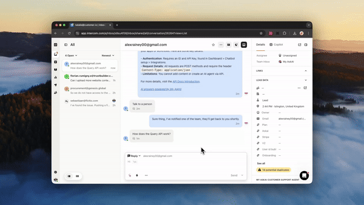

# Chrome Extension

### What are the benefits of the Chrome Extension?

There are several reasons you might want to use our AI Copilot Chrome Extension:

* You want your support team to use AI but aren't quite ready to have it directly reply to customers.
* You want to supercharge your agent's productivity by giving them AI answering tools.
* You want to respond to customers in a variety of channels, tools and platforms, wherever they are speaking to customers.&#x20;
* Your queries aren't best suited to AI responses, but your agents could use a tool to help them work more efficiently.
* The Chrome Extension uses both your [public and private](../private-internal-mode.md) content uploaded to your AI agent to answer questions, so you can include internal processes and policies that you don't necessarily want to make public to help improve your answers.

Get the extension:



### How to use your AI Copilot Chrome Extension



### How do I install the Chrome Extension Copilot?

1. Go to **Channels** and scroll to the section titled **Chrome extension** and click "Enable Chrome extension".

<figure><figcaption></figcaption></figure>

2. Go to the Chrome Web Store and [Install the My AskAI app](https://chromewebstore.google.com/detail/my-askai-ai-customer-supp/bamboiagbocaobgfbkjehlaojipfjecf).
3. Return to My AskAI and open the My AskAI Chrome extension from your extensions menu, the side panel will then open on the right hand side.

<figure><figcaption></figcaption></figure>

3. Copy the code from Step 2 in the My AskAI Chrome extension instructions and paste it into the field in the side panel menu, then click Save.&#x20;

<figure><figcaption></figcaption></figure>

4. Congratulations! Your AI copilot has now been installed! You should see it appear as a chat window in the side panel.

<figure><figcaption></figcaption></figure>

### How can I use the Chrome Extension?

There are 3 main ways you can use your AI Copilot Chrome Extension today:

1. **Copilot**\
   Once installed, you can open your AI copilot by clicking the My AskAI extension button and then asking your question in the chat window. Once you have your response you can paste the answer over to wherever you need it.

<figure><figcaption></figcaption></figure>

2. **Right-click to ask a question**\
   Highlight any text in your Chrome browser, right-click and choose "Ask AI Agent" from the menu. Your AI copilot side panel will then appear and your question answered. You can then copy and paste the response wherever you choose.&#x20;


If you ask another question with right-click it will replace the existing question and answer.


<figure><figcaption></figcaption></figure>

3. **Embedded Copilot (in Intercom, Zendesk or Freshdesk)**\
   You can use your AI copilot to respond to customers in Intercom, Zendesk or Freshdesk without installing any apps. Once the Chrome extension is installed and you are logged into your respective platform, you will see a magic sparkle icon (:sparkles:) button appear in your text editor. Click it and it will use the conversation history, the last question and your AI agent's knowledge to draft a response in the text editor that you can tweak before sending to the customer.\
   \
   Here's it in action in each of these:

**Intercom**

<figure><figcaption></figcaption></figure>

**Zendesk**

<figure><figcaption></figcaption></figure>

**Freshdesk**

<figure><figcaption></figcaption></figure>

If you are looking for any more features from our Chrome Extension, let us know.

### I can't see the magic sparkle icon (:sparkles:) for the Chrome Extension Copilot?

If you can't see the magic sparkle icon for the Chrome Extension Copilot, then first make sure you have [installed the extension](chrome-extension.md#how-do-i-install-the-chrome-extension-copil).

Also, ensure you are using one of the supported platforms for the Copilot: Intercom, Zendesk, Gorgias or Freshdesk.

If you still aren't seeing the icon, ask to "Talk to a person" in our live chat and our support team will assist you.

### How much does the Chrome extension cost?

There are no additional fees or charges to use the Chrome extension copilot.&#x20;

You do not have to pay team seat fees, the only charges will be based on your overall account (i.e. conversation) usage, so feel free to share with all your team mates!

### What permissions does the Chrome extension have?

When you install your Chrome Extension you may see a message like this:

<figure><figcaption></figcaption></figure>

What this means is that when you launch the Chrome Extension and actually open it, it can view the HTML of the webpage you’re on (Almost all Chrome Extensions work in this way).&#x20;

The reason we need to view the HTML of the webpage you’re on is to know what text is being passed to the Chrome Extension, because of the "[Right-click to ask](chrome-extension.md#how-can-i-use-the-chrome-extension)" feature.&#x20;

The extension doesn't look at or use the data on your webpages when the extension isn’t being used or when you are not using the "Right-click to ask" feature.

The only information stored is the question put into the AI Copilot.&#x20;

The extension has access to the HTML/webpage, but doesn’t store or process it unless requested, and it still only processes the question provided as an input.
