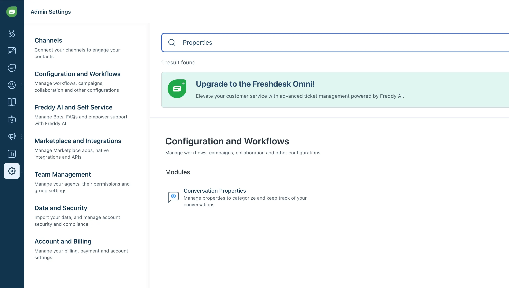

# Freshchat

<figure><figcaption></figcaption></figure>

You can now integrate your AI support agent directly into Freshchat for a seamless AI experience.


The Freshchat integration is available on all paid plans, [see pricing](https://myaskai.com/pricing).


### What are the benefits of using My AskAI within Freshchat?

There are several reasons why you should use your My AskAI within Freshchat:

* You can add more knowledge to your AI agent in addition to your website and Freshdesk help center by using our [connections](../../connections/), live data or [file uploads](../../file-uploads.md).
* You don't have to add any code to your site to get your AI agent live, just connect our app and you're ready to go.
* As well as an AI agent, you get all our other features like [Improve,](../../improve/) [Insights](../../insights/), [Email Assistant](../../email-assistant.md), [Site Search](../../site-search.md), [Private (Internal) mode](../../private-internal-mode.md), [Integrations with Slack](../) and more.&#x20;
* While Freshchat has its own AI agent (called "FreddyAI"), it can be more expensive, up to twice the price of My AskAI per conversation (we also think ours is smarter, but we'll let you be the judge!)

### How to use your AI agent within Freshchat



### How to connect your AI agent to Freshchat


Ensure that you have turned off Freddy before completing these steps.


1. Login to your Dashboard and go to _**Channels**_.&#x20;
2. Once enabled you will see "Add to live chat apps" appear, click on the Freshchat icon.

<figure><figcaption></figcaption></figure>

3. To connect your Freshchat account enter your API key and Chat URL. To find these in your Freshchat dashboard go to:\
   \
   &#xNAN;_**Admin Settings > Marketplace and Integrations > API Settings > API details for chat > "Your API key" OR "Your chat URL"**_\
   \
   Once you have both of these values, enter them into their respective fields and press the "**Connect your Freshchat account**" button.

<figure><figcaption></figcaption></figure>


If you need to create an API key you can do so by [following the instructions here](https://support.freshchat.com/support/solutions/articles/50000000011).


4. When connected the button will change to say "**Freshchat account connected**".

<figure><figcaption></figcaption></figure>

4. You now need to create a new webhook, to do this in your Freshchat dashboard go to:\
   \
   &#xNAN;_**Admin Settings > Marketplace and Integrations > Conversation Webhooks**_\
   \
   Then toggle the webhook from Disabled to **Enabled.**

<figure><figcaption></figcaption></figure>

5. Once enabled, copy the webhook address from My AskAI and paste it into Freshchat's webhook field, then enter your email for failure notification alerts and click save.\
   \
   Webhook address: [https://myaskai.com/api/1.1/wf/freshchat-webhook](https://myaskai.com/api/1.1/wf/freshchat-webhook)

<figure><figcaption></figcaption></figure>


You do not need to do anything with the authentication header key


6. To confirm the webhook has been set up correctly, send a test message to your Freshchat widget.

<figure><figcaption></figcaption></figure>

7. This message will be confirmed as received when you see the _"Webhook successfully setup"_ message appear in your My AskAI setup page.

<figure><figcaption></figcaption></figure>

7. Your AI agent is now connected to Freshchat and will be [providing "note" responses](./#how-to-draft-ai-conversational-replies-to-users-without-sending-them) (not directly to customers).

### How can I use my AI support agent within Freshchat?

There are 3 ways you can use your AI agent within Freshchat:

1. [_As a full conversational AI agent_](./#how-to-set-up-an-ai-powered-chatbot-within-intercom-fully-conversational-support)_._
2. [To provide "Note" replies to all messages.](./#how-to-draft-ai-conversational-replies-to-users-without-sending-them-in-freshchat)
3. [_As a co-pilot for your human agents to help them improve their efficiency_](../chrome-extension.md)_._

### How to set up an AI-powered support agent within Freshchat (Fully conversational support)

1. [Connect your AI agent to Freshchat](./#how-to-connect-your-ai-chatbot-to-intercom)
2. Toggle conversational replies "on" by going to your Dashboard then _**Channels > Freshchat**_ clicking the "Reply directly to customers" button.

<figure><figcaption></figcaption></figure>

3. That's it! Your Freshchat will now automatically respond to user queries using your AI agent's knowledge.


New conversations start (and are transferred back to the AI agent) after:

_A conversation is resolved AND the “threading interval” has passed (which can be customised per Topic)_



### How to draft AI conversational replies to users, without sending them in Freshchat

You can set the agent to automatically create AI note responses for you to use instead of replying directly to the user, to do this:

<figure><figcaption></figcaption></figure>

1. [Connect your AI support agent to Freshchat](./#how-to-connect-your-ai-chatbot-to-intercom)
2. Toggle note replies "on" by going to your Dashboard then _Channels > Freshchat_ clicking the "Reply with 'notes' for admins" toggle.

<figure><figcaption></figcaption></figure>

3. That's it, now when someone talks with your Freshchat you will see the AI response appear as a note you can use to help with your reply.

### How does human handover work when using the Freshchat integration?

If, at any time, the user wishes to be passed over to a person to continue the conversation, all they need to do is say so, saying "Talk to a person" (or similar words to that effect).

Once the conversation is passed over to the human, the AI will not respond again until the agent hands back control to the AI.

When the AI agent cannot answer a question, it will also prompt the user to type "Talk to a person" to make it obvious they can speak to a person.

As part of the handover, the AI agent will summarize the conversation so the agent can pick up where the user left off so there is no repetition or frustration.

### How do I add conversation properties so I know what the AI Chat Status of a Freshchat conversation is?

To add AI statuses of to a Freshchat conversation:

1. Create a conversation property within Freshchat (we can’t create these automatically, unfortunately) by going to **Freshchat Admin Settings > Configuration and Workflow > Conversation Properties**

<figure><figcaption></figcaption></figure>

2. Create a new **Dropdown** property called: **AI Chat Status**, and ensure the "Internal name" is: `ai_chat_status` . \
   \
   You do not need to add any "choices".

<figure><figcaption></figcaption></figure>

3. Now in your conversation inbox you will see your new AI Chat Status property.

<figure><figcaption></figcaption></figure>

4. Your new AI Chat Status will always be **one** of:
   * `ai-agent-replied`: used when the AI agent has sent any reply
   * `human-handover-requested`: used when the AI agent wants to handover a chat to a human agent
   * `ai-agent-tag-blocked`: used when a chat is about a topic/tag that has been blocked

### How do I know what the Freshchat AI agent has replied to and what has been handed to a human agent?

When a ticket is replied to by your AI agent in Freshchat  you will see the AI response in the conversation thread.

Additionally ([if you have created your AI Chat Status for Freshchat](./#how-do-i-add-conversation-properties-so-i-know-what-the-ai-status-of-a-conversation-is)) you will see the AI Chat Status tag updated to `ai-agent-replied`  for the thread.

When a conversation is replied to by a customer requesting a person (if they need more help for instance) then an internal note is also added to the ticket and ([if you have created your AI Chat Status for Freshchat](./#how-do-i-add-conversation-properties-so-i-know-what-the-ai-status-of-a-conversation-is)) the AI Chat Status is updated to `human-handover-requested`.

Assuming you have [created your AI Chat Status](./#how-do-i-add-conversation-properties-so-i-know-what-the-ai-status-of-a-freshchat-conversation-is) you can then use the `ai-agent-replied` and `human-handover-requested` conversation properties to create custom views in Freshchat to manage the escalated tickets or review AI agent responses.

Create a new view and filter using the AI Agent status field: `ai-agent-replied` or `human-handover-requested` or `ai-agent-tag-blocked` .

<figure><figcaption></figcaption></figure>

### How can I take control from or give control to the AI agent in Freshchat?

You can give control or take back control from the AI at any time, here's how:

#### To take control of a conversation

Just reply to any open conversation as an admin/agent and the conversation's control will be taken from the AI agent.

### How can I add my agent as part of a triaged chatbot in Freshchat?

1. [Connect your agent to Freshchat](./#how-to-connect-your-ai-chatbot-to-intercom)
2. Turn on the toggle switch for Chatbot/Triage settings

<figure><figcaption></figcaption></figure>

3. Decide on a trigger phrase to use for your AI chatbot handover button, type it into the field below the toggle switch and include this as the text in a button in your chatbot (example chatbot flow below for "Speak to AI" as the trigger phrase).


This phrase must _**exactly**_ match the pre-defined button you are going to use in your chatbot message.


<figure><figcaption></figcaption></figure>

<figure><figcaption></figcaption></figure>

4. Ensure you end the AI chatbot with "Make available for assignment".

<figure><figcaption></figcaption></figure>

5. Your AI agent will now only begin responding after the "Speak to AI" button has been pressed.

### How can I stop the AI agent from replying to specific topics in Freshchat?

To stop your AI agent from replying to specific topics in Freshchat you can use our [Block replies feature within Freshchat tagging](freshchat-tagging.md).

### How can I reassign a Freshchat conversation that has been handed over or escalated to a member of my team?

To reassign a Freshchat ticket or conversation to a member of your team once it has been handed over create a Conversation Assignment Rule (**Freshchat Admin Settings > Configurations and Workflows > Workflows> Conversation Assignment Rules**) for conversations with AI Chat Status = `human-handover-requested` that re-assigns conversations to agents or groups.

<figure><figcaption></figcaption></figure>

### How do I auto-close a ticket in Freshchat after a set amount of time?

You can auto-close tickets in Freshchat (that have not been transferred to a person) after a certain time period without a response to an AI agent's response by:

1. Going to **Channels > Add to live chat apps** and click on the Freshchat icon
2. In the pop-up, scroll to "Use inactivity auto-close settings" and toggle "Automatically close a conversations" to the On position

<figure><figcaption></figcaption></figure>

3. Set the amount of time you want the ticket to close after (by default this is 60 mins)
4. (Optional) You can also set a message to send automatically when the ticket closes notifying the user the ticket will be closed.
5. These changes will go live immediately.

### Will the AI agent use responses to questions the customer has given as part of my chatbot?

Yes, your AI agent will use responses given by customers to chatbot questions as context for its responses.

This is a great way to improve the accuracy of your AI agent's responses and ensure a better user experience.

### Can I stop people speaking to a person on their first message on Freshchat?

You can prevent "instant" human handover on the 1st message in a conversation on Freshchat by navigating to **Channels > Freshchat** and then toggling the "_Ask for more information before handover_" feature.

<figure><figcaption></figcaption></figure>

This option is on by default.

When a user tries to handover immediately they will be asked to provide more information first. On any subsequent messages, they can initiate a handover to an agent.

### How can I add my Freshchat AI agent to other services, like WhatsApp, Instagram, Facebook Messenger, or SMS?

You can use the Freshchat integration to use your AI agent directly within:

* WhatsApp
* Instagram DMs
* Facebook Messenger
* SMS

It will retain all the [same features of the Freshchat agent](./#how-can-i-use-my-ai-chatbot-within-intercom), including human handover, but within the respective platforms.

### Which Freshchat plan do I need to be on to use My AskAI?

You can use the My AskAI Freshchat integration as long as you are on a Freshchat Pro plan or above.

### Can I turn off the "Just thinking..." or "Just having a think..." messages in Freshchat?

Yes you can turn off the "Just thinking" or "Just having a think" messages.

Just go to **Channels > Freshchat > Other Settings** and toggle the "Hide the "just thinking" message to off.

### How can I pause or temporarily turn off AI replies or notes in Freshchat?

To pause or temporarily pause AI replies or notes in Freshchat go to **Channels > Freshchat** then scroll to the toggle for "Pause AI agent".

<figure><figcaption></figcaption></figure>

When you are ready to turn it back on, just toggle the Pause button once more and it will start responding again.
