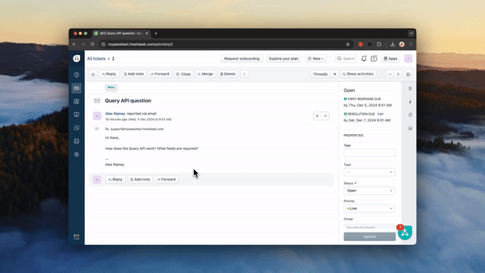

# Freshdesk

<figure><figcaption></figcaption></figure>

You can now integrate your AI agent directly into Freshdesk Tickets for a seamless AI support experience.

The Freshdesk Ticket integration is available on all paid My AskAI plans, [see our pricing](https://myaskai.com/pricing).

### What are the benefits of using My AskAI within Freshdesk Tickets?

There are several reasons why you should use your My AskAI within Freshdesk Tickets:&#x20;

* You get access to an intelligent AI agent, directly within Freshdesk Tickets that can automatically and instantly answer user or visitor queries, using your company knowledgebase.
* Your AI agent can respond either [directly](freshdesk.md#direct-replies) to users, generate [Internal notes](freshdesk.md#internal-notes) for you, or [generate AI responses on demand](freshdesk.md#how-can-i-use-my-zendesk-ticket-ai-agent-to-reply-to-follow-up-tickets).
* You can add more knowledge to your AI agent in addition to your website and Freshdesk help center by using our [connections](../connections/) or [file uploads](../file-uploads.md).
* You don't have to add any code to your site and you don't need a developer, [just connect our app and you're ready to go](freshdesk.md#how-to-connect-your-ai-chatbot-to-zendesk-messaging).
* AI answers provided with "References" to the sources used to answer the question.
* You can add your AI agent to [Freshchat](freshchat.md) too.
* As well as an AI agent, you get all our other features like [Insights](../insights/), [Email Assistant](../email-assistant.md), [Site Search](../site-search.md), [Private (Internal) mode](../private-internal-mode.md), [Integrations with Slack](./) and more.&#x20;

### How to connect your AI agent to Freshdesk Tickets


_**Recommended:**_ AI replies will come from whichever agent account you set them up on in Freshdesk, therefore we would recommend create a new agent account/seat for your AI agent and using this account's API keys.


1. Install My AskAI to your Freshdesk workspace ([from the Freshworks marketplace](https://www.freshworks.com/apps/))
2. Login to your Dashboard and go to _**Channels**_.&#x20;
3. Once enabled you will see "Live Chat apps" appear, click on the Freshdesk icon.

<figure><figcaption></figcaption></figure>

4. Select 'Freshdesk Tickets'

<figure><figcaption></figcaption></figure>

5. Enter your Freshdesk domain (your domain is within the URL of your Freskdesk inbox. e.g. **myaskai**.freshdesk.com) and your API key and click 'Connect your Freshdesk account'.


When adding your Freshdesk domain, ensure it is your original Freshdesk domain e.g. yourdomain.freshdesk.com, not any custom domains you may now use.



To find your API key go to your dashboard, click on your _**Profile icon > Profile Settings > View API Key**_ and copy your API key ([more details here](https://support.freshdesk.com/support/solutions/articles/215517-how-to-find-your-api-key)).


<figure><figcaption></figcaption></figure>

6. Once connected it'll change to say "Freshdesk account connected" and look like this:

<figure><figcaption></figcaption></figure>

7. Once back at My AskAI, you can choose how you want your AI agent to reply, by default it will create [Internal Note](freshdesk.md#internal-notes) responses, but you can also enable [Direct replies](freshdesk.md#direct-replies).&#x20;

<figure><figcaption></figcaption></figure>

7. You will now be generating AI replies to your tickets, test it out by emailing your Freshdesk inbox.&#x20;

<figure><figcaption></figcaption></figure>

### What will my Freshdesk Ticket AI agent respond to?

By default your Freshdesk Ticket AI agent will respond to Email and Web form tickets that are "New".

### How can I control what my Freshdesk Ticket AI agent responds to?

When your AI agent within Freshdesk Tickets is created we create an Automation (found in Settings) for New and Updated tickets.&#x20;

<figure><figcaption></figcaption></figure>

You can amend this and add conditions to the My AskAI automation to filter which tickets should be routed to your AI agent.

<figure><figcaption></figcaption></figure>

### How do I know what the Freshdesk Ticket AI agent has replied to and what has been handed to a human agent?

When a ticket is replied to by your AI agent in Freshdesk Tickets you will see the AI response in the ticket thread.

When a ticket is replied to by a customer (if they need more help for instance) then an internal note is added to the ticket.&#x20;

<figure><figcaption></figcaption></figure>

### How can I use my AI support agent within Freshdesk Tickets?

Once you've connected the My AskAI agent within your Freshdesk Admin Centre, it will automatically start responding to user's questions with Internal Notes within the Freshdesk Ticket responder by default.&#x20;

#### Internal Notes

For the first question of each ticket an Internal Note will be generated by the AI, you can then use this information to assist you in the composition of your response.

With each question, the links used to answer the question will be provided.

<figure><figcaption></figcaption></figure>

#### Direct Replies

Alternatively, you can have your Freshdesk Tickets AI agent respond directly to customers by toggling to "Reply directly to customers" within your Freshdesk Ticket setup settings in My AskAI.

By default, all messages of the ticket will be replied to, however you can change this by selecting "Reply to 1st message only".

<figure><figcaption></figcaption></figure>


If you’re using your AI agent to directly reply to users in Freshdesk Tickets, we recommend you disable automatic email replies (for ticket creation acknowledgement), otherwise users will receive multiple emails.&#x20;


### How does human handover work when using the Freshdesk Ticket integration?

When using in either [Direct reply](freshdesk.md#direct-replies) or [Internal Note](freshdesk.md#internal-notes) reply mode, by default your Freshdesk Ticket AI agent will respond to all Ticket messages sent to you. You can change this however by selecting "Reply 1st message only".&#x20;

<figure><figcaption></figcaption></figure>

If you change to "Reply to 1st message only", any further questions or responses will be handed over to you, as the agent, to address.

<figure><figcaption></figcaption></figure>

If however, you have selected for the AI to "Reply to all messages" then you can choose when you want the AI to hand over the conversation to your human agents, either select:

* "Can't answer a question" - when it can't answer a question instead of saying as such it will automatically pass over to a person

<figure><figcaption></figcaption></figure>

* "Customer handover request"- it will only handover if the customer explicitly requests to speak to a human agent&#x20;

<figure><figcaption></figcaption></figure>

If you only have set your AI agent respond to the first ticket message you can also continue using our AI agent responses for follow-up questions with our [AI drafting tool](chrome-extension.md).&#x20;

### How can I use my Freshdesk Ticket AI agent to reply to follow-up tickets?

Once you have [installed your Freshdesk Ticket AI agent](freshdesk.md#how-to-connect-your-ai-agent-to-zendesk-tickets), you can also use your AI agent within the agent workspace to draft a reply to the customer's follow-up questions whenever you want.

To use it:

1. Open a new ticket
2. Within the response composer, find the magic sparkle icon :sparkles:
3. Select the icon and then click "Draft AI agent response"
4. An AI response will be generated for you like magic!

<figure><figcaption></figcaption></figure>

### How do I remove my Freshdesk Ticket AI agent?

1. Login to your Dashboard and go to _Channels_.&#x20;
2. If enabled you will see "Live Chat apps" appear, click on the Freshdesk icon.

<figure><figcaption></figcaption></figure>

3. Select 'Freshdesk Tickets'

<figure><figcaption></figcaption></figure>

4. Expand the "Install My AskAI within Freshdesk" header and click "Disconnect Freshdesk Integration" then confirm your deletion.

<figure><figcaption></figcaption></figure>

### How can I pause or temporarily turn off AI replies or notes in Freshdesk?

To pause or temporarily pause AI replies or notes in Freshdesk go to **Channels > Freshdesk** then scroll to the toggle for "Pause AI agent".

<figure><figcaption></figcaption></figure>

When you are ready to turn it back on, just toggle the Pause button once more and it will start responding again.
