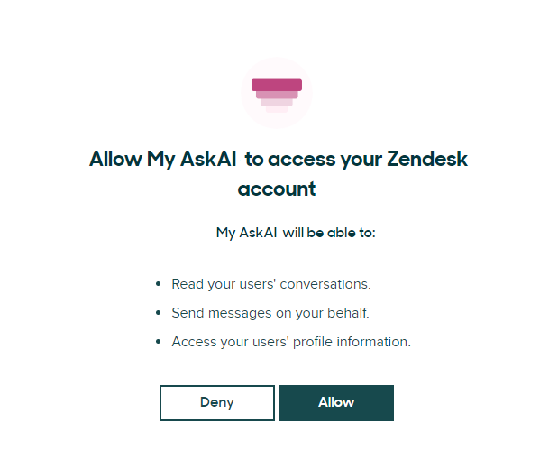
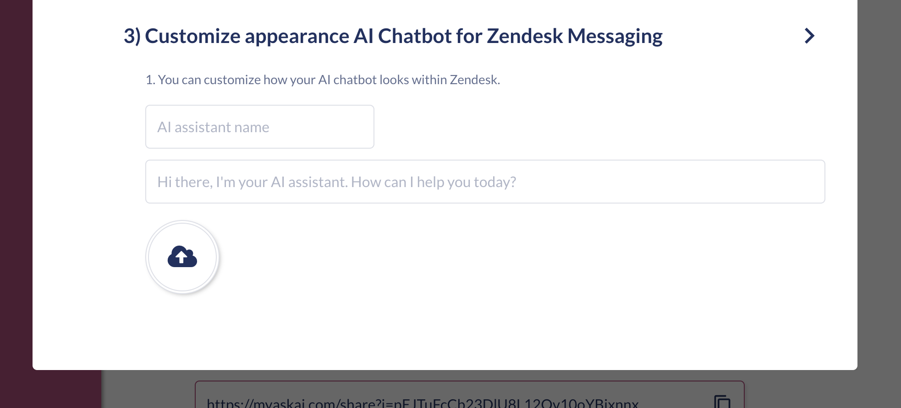

# Zendesk (Messaging)

<figure><figcaption></figcaption></figure>

You can now integrate your AI agent directly into Zendesk Messaging for a seamless AI experience.


The Zendesk Messaging integration is available on all paid My AskAI plans, [see our pricing](https://myaskai.com/pricing).\
\
All Zendesk Messaging bot integrations require you to have Sunshine Conversations access (on the Zendesk Suite Professional plan or above) and usage purchased or included in your Zendesk plan.&#x20;

If you would like to learn more about purchasing Sunshine Conversations, please speak directly with Zendesk who will be happy to help.


### What are the benefits of using My AskAI within Zendesk Messaging?

There are several reasons why you should use your My AskAI within Zendesk Messaging:&#x20;

* While Zendesk has its own AI agent (called "Zendesk AI"), it is expensive, around 5-10x the price of My AskAI per conversation (we also think ours is smarter, but we'll let you be the judge!)
* You get access to an intelligent AI agent, directly within Zendesk Messaging that can automatically and instantly answer user or visitor queries, using your company knowledgebase.
* You can add more knowledge to your AI agent in addition to your website and Zendesk help center by using our [connections](../../connections/) or [file uploads](../../file-uploads.md).
* You don't have to add any code to your site to get your AI agent live, [just connect our app and you're ready to go](zendesk-messaging.md#how-to-connect-your-ai-chatbot-to-zendesk-messaging).
* Every AI answer is provided with reference links to the sources used to answer the question.
* You can add your AI agent to Zendesk's other messaging channels e.g. WhatsApp, Facebook Messenger, and many more
* As well as an AI agent, you get all our other features like [Improve](../../improve/), [Insights](../../insights/), [Email Assistant](../../email-assistant.md), [Site Search](../../site-search.md), [Private (Internal) mode](../../private-internal-mode.md), [Integrations with Slack](../) and more.&#x20;

See how Customer.io are using My AskAI within Zendesk to reduce their ticket volume by 47%:



### How to connect your AI agent to Zendesk Messaging


You must be an Admin in your Zendesk account to connect your AI agent to Zendesk



How to add My AskAI to your Zendesk Mesaging widget


1. Login to your Dashboard and go to _Channels_.&#x20;
2. Go to the section "Add to your existing support tools" and click on the Zendesk icon.

<figure><figcaption></figcaption></figure>

3. Click to connect your Zendesk account:

<figure><figcaption></figcaption></figure>

4. If you have multiple Zendesk accounts, you will need to input your Zendesk subdomain, which you can find by looking at the URL of your Admin Center or Agent Dashboard e.g. (the text in <mark style="color:blue;">**blue**</mark> is the subdomain):\
   \
   &#x20;       _https://<mark style="color:blue;">**teammyaskai**</mark>.zendesk.com_\

5. Enter your subdomain and click "Sign in"

<figure><figcaption></figcaption></figure>

6. Allow access to your Zendesk account

<figure><figcaption></figcaption></figure>

7. You'll then be shown a "Connecting to Zendesk" screen, which will take a few seconds, once connected you will be redirected back to My AskAI.
8. Once back at My AskAI, you will be shown instructions to help you "Configure your Zendesk account"
9. Go to your Zendesk Admin Center, click _**AI > AI Agents**_ then select '**Connect**' beside the My AskAI AI agent and '**Connect**' again on the pop-up, then click the 3 dots on the right hand side and select "Set as default for all channels".

<figure><figcaption></figcaption></figure>

10. After tickets have been 'Solved' they need to be moved to 'Closed', so that the AI assistant can take control of the conversation again. There are two ways you can do this.
    1.  Go to _**Objects and rules > Automations**_, and find the existing automation called "Close ticket 4 days". Edit the "Hours since status..." field to 1 (recommended, but you can choose your own value). This means after tickets are solved, they will be closed within an hour and control returned to the AI assistant.\

        <figure><figcaption></figcaption></figure>
    2. If you want to immediately pass back control to the AI assistant when a ticket has been solved, then you will need to set up a 'Trigger'. To do this, go to _**Objects and rules > Triggers > Create trigger.**_\
       \
       Create the following trigger:\
       \
       **Trigger name**: Auto-Close Solved Ticket\
       **Description**: Close a ticket that has been marked as solved\
       **Category**: Ticket Status (you may have to + Add Category if this is not already available)\
       **Conditions**: Meet ALL of the following conditions: _Ticket > Status category_ | _IS_ | _Solved_\
       **Actions:** _Ticket Status > category_ | _Closed_

<figure><figcaption></figcaption></figure>

<figure><figcaption></figcaption></figure>

12. Go back to My AskAI and click the "_I've completed these steps_" button.
13. Customize the appearance of your AI agent by naming it and giving it a logo. This name and logo will appear within the Zendesk Messaging widget when your AI assistant is replying.

<figure><figcaption></figcaption></figure>

14. You're all done! Ask questions to your new AI agent within your Zendesk Messaging widget and see how it responds.


Once you have enabled My AskAI in Zendesk Messaging, it will start responding automatically, there is no "Internal Notes" mode for replies in Zendesk Messaging (only Zendesk Tickets). \
\
You can, however, pause replies at any time once set up by going to **Channels > Zendesk > Zendesk Messaging**, scrolling to the bottom of the page and toggling "Pause reples" on.


### Are tickets automatically created for conversations when the AI replies in Zendesk Messaging?

No, a ticket is not automatically created for every conversation the AI replies to in Zendesk Messaging.

A ticket is only created in Zendesk Messaging when the conversation is passed over to a human.

At the point of this handover, the ticket will be created and the history of the conversation will be accessible.

### How can I use my AI agent within Zendesk Messaging?

Once you've connected the My AskAI agent within your Zendesk Admin Centre, it will automatically start responding to user's questions within the Zendesk Messaging chat widget.&#x20;

With each question, it will provide the reference link used to answer the question.

<figure><figcaption></figcaption></figure>

### How does human handover work when using the Zendesk Messaging integration?

If, at any time, the user wishes to be passed over to a person to continue the conversation, all they need to do is say so, saying "Talk to a person" (or similar words to that effect) or just press the "Talk to someone" button at the end of the most recent message.

Once the conversation is passed over to the human, the AI will not respond again until the agent hands back control to the AI or the ticket is closed.

As part of the handover, the AI agent will summarize the conversation so the agent can pick up where the user left off so there is no repetition or frustration.

### How can I stop the AI agent from replying to specific phrases in Zendesk Messaging?

To stop your AI agent from replying to a specific set of phrases, share with us a list of the phrases you would like to block via chat and we will update your bot with these.

(Available on Pro accounts and above).

### Can I stop people speaking to a person on their first message on Zendesk Messaging?

You can prevent "instant" human handover on the 1st message in a conversation on Zendesk Messaging by navigating to **Channels > Zendesk** and then toggling the "_Ask for more information before handover_" feature.

<figure><figcaption></figcaption></figure>

This option is on by default.

When a user tries to handover immediately they will be asked to provide more information first. On any subsequent messages, they can initiate a handover to an agent.

### Can I have multiple AI agents responding to my Zendesk Messaging?

Yes, you can have multiple AI agents set-up to respond to your Zendesk Messaging.

There are occasions where you may need to use separate AI agents, whether you have separate brands, products or user groups, for example.

In these instances, it can make sense to have separate agents responding, so you can set separate controls, guidance, or knowledge and ensure there is no risk of "mixing up" answers.

To do this:

1. &#x20;Set up separate AI agent accounts for each use case and connect your knowledge.
2. [Follow the normal setup steps as outlined above](zendesk-messaging.md#how-to-connect-your-ai-agent-to-zendesk-messaging).
3. When you are updating the 2 My AskAI triggers that you have created, append to each of them a unique identifier to the `organization_id` field e.g.  `-1` (or `-2` if it is a third account)

<figure><figcaption></figcaption></figure>

4. Once you have done this, notify us via our live chat, sharing the email addresses of the accounts you have created and the unique identifiers you have used and we will update your account settings.

### How do I remove my Zendesk Messaging AI agent?

1. Go to your Zendesk Admin Center, click _**Channels > Bots > Manage Bots**_ and look for 'My AskAI' (at the bottom)

<figure><figcaption></figcaption></figure>

2. Click the 3 dots next to the 'Connect' button, then select 'Uninstall':

<figure><figcaption></figcaption></figure>

3. On the pop-up, click to confirm the Uninstall:

<figure><figcaption></figcaption></figure>

4. Your My AskAI bot will now disappear from your 'Channels' view and you will have fully removed and disconnected your AI agent.

### Do conversations with the AI agent create new tickets in Zendesk Messaging?

A ticket is only created in the Zendesk inbox from a Zendesk Messaging conversation with the AI agent if the conversation is transferred to a person, i.e. when the user types "Talk to a person" (or similar) or uses the "Speak to someone" quick reply.

If they never choose one of these options, you will not see a ticket created.

This is how all Zendesk Messaging app integrations work.

### How can I add my AI agent to other channels that Zendesk Messaging offers? E.g. WhatsApp, Instagram, Facebook Messenger

Your AI agent will work with any additional messaging channels you connect​ it to within Zendesk Messaging. The messaging channels available are:

* WhatsApp
* Instagram DMs
* Facebook Messenger
* Android
* iOS
* Unity
* LINE
* Slack
* WeChat
* Twitter/X DMs

It will retain all the same features of the AI agent, including human handover, but within the respective platforms.

Refer to [Zendesk's instructions on how to get each channel set-up with your AI agent](https://support.zendesk.com/hc/en-us/sections/4405298883482-Third-party-and-social-messaging-channels).

### How can I capture an email in Zendesk Messaging?

If you are using the Zendesk integration we recommend you use Zendesk authentication to authenticate a user and pass their email into the Zendesk widget (this will then appear in My AskAI’s insight data as well).&#x20;

### How is a user authenticated in Zendesk Messaging?

To authenticate a user in Zendesk Messaging, so you can use [User Data API](../../user-data-api/) features, you must use Zendesk's widget authentication.

### How do I edit the Starter questions in the Zendesk Messaging widget?

To edit the starter questions in the Zendesk Messaging widget go to the **Dashboard**, then **AI Agent Setup > Customization > Starter Questions** - from here you can add or remove the Starter questions and they will be updated in your Zendesk Messaging widget.

### Can I train it on my Zendesk Macros?

Yes, when you connect your Zendesk account to My AskAI, we will automatically import your Zendesk Macros as [Custom Answers](../../improve/#custom-answers) (where you can edit and manage them).

You can confirm they have been imported by going to the **Knowledge** section of your **Dashboard**.

### How can I pause or temporarily turn off AI replies or notes in Zendesk Messaging?

To pause or temporarily pause AI replies or notes in Zendesk Messaging go to **Channels > Zendesk Messaging** then scroll to the toggle for "Pause AI agent".

<figure><figcaption></figcaption></figure>

When you are ready to turn it back on, just toggle the Pause button once more and it will start responding again.
