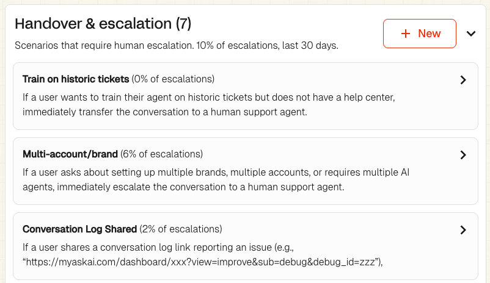

# Zendesk Playbooks

### Only use AI agent for out-of-hours replies in Zendesk Tickets

To set your Zendesk AI agent to only reply to tickets out-of-hours:

1. Create a [schedule](https://support.zendesk.com/hc/en-us/articles/4408842938522-Setting-your-schedule-with-business-hours-and-holidays) in Zendesk for your business hours
2. Edit the My AskAI trigger in Zendesk "Notify My AskAI..."
3. Add a new condition to the list "Meet ALL of the following conditions"
4. New conditions: Ticket within business hours > is > No

<figure><figcaption></figcaption></figure>

This means that the AI agent will only be notified about tickets outside of business hours.

### How to collect email on handover/escalation in Zendesk Messaging

When a Zendesk Messaging conversation has been handed over or escalated to an agent, you will likely want to collect the email address of the user or customer if they were a visitor.

There are 2 ways you can do this depending on your needs:

#### 1. Collect the email using a form within the Zendesk Messaging widget

**Pros**: The email is collected using a form so the email can be added as an attribute or property within Zendesk ticket or user.

**Cons**: The message sent when collecting the email cannot be edited, it will say _"We're offline. Check back later or leave your email to be notified when an agent responds"_.

**How to set up:**

1. In Zendesk go to: **Objects and rules > Business rules > Messaging triggers**
2. Create a trigger and name it e.g. "Ask for email after human handover" with a description e.g. "Ask for email after the AI agent hands the messaging conversation to a human agent"
3. Setup with the following settings:\
   \
   Activate this trigger = checked\
   Run only once per ticket = checked\
   Visual selected\
   Run trigger = When a customer requests a conversation\
   Conditions = Match ANY of these conditions - Customer email Does not contain @ \
   Actions = Request email (continuous conversation)

<figure><figcaption></figcaption></figure>

#### 2. Collect the email in the chat within the Zendesk Messaging widget

**Pros:** Complete customizability of the email request message.&#x20;

**Cons:** The email is collected within the chat as text, it is not saved to the Zendesk ticket or user itself.

**How to set up:**

1. In Zendesk go to **Zendesk Admin Centre > Messaging triggers > Create trigger**
2. Setup with the following settings (as in the below screenshot):\
   \
   Activate this trigger = checked\
   Run only once per ticket = checked\
   Visual selected\
   Run trigger = When a customer requests a conversation\
   Conditions = Match ANY of these conditions - Customer email Does not contain @ \
   Actions = Send message to customer, Name of agent: AI Agent, Message: e.g. What's your email, please?

<figure><figcaption></figcaption></figure>
