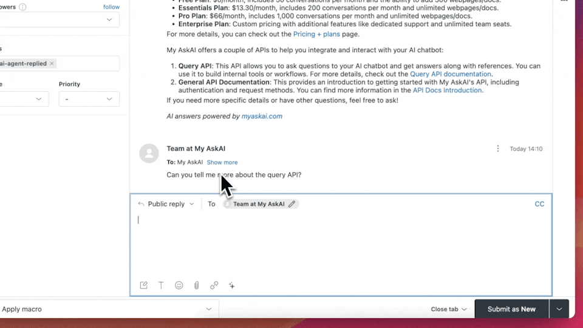

# Zendesk (Tickets)

<figure><figcaption></figcaption></figure>

You can now integrate your AI agent directly into Zendesk Tickets for a seamless AI support experience.

The Zendesk Ticket integration is available on all paid My AskAI plans, [see our pricing](https://myaskai.com/pricing).

### What are the benefits of using My AskAI within Zendesk Tickets?

There are several reasons why you should use your My AskAI within Zendesk Tickets:&#x20;

* You get access to an intelligent AI agent, directly within Zendesk Tickets that can automatically and instantly answer user or visitor queries, using your company knowledgebase.
* Your AI agent can respond either [directly](zendesk-tickets.md#direct-replies) to users, generate [Internal notes](zendesk-tickets.md#internal-notes) for you, or [generate AI responses on demand](zendesk-tickets.md#how-can-i-use-my-zendesk-ticket-ai-agent-to-reply-to-follow-up-tickets).
* You can add more knowledge to your AI agent in addition to your website and Zendesk help center by using our [connections](../../connections/) or [file uploads](../../file-uploads.md).
* You don't have to add any code to your site and you don't need a developer, [just connect your Zendesk account and you're ready to go](zendesk-tickets.md#how-to-connect-your-ai-chatbot-to-zendesk-messaging).
* AI answers provided with "References" to the sources used to answer the question.
* You can add your AI agent to [Zendesk's Messenger](zendesk-messaging.md) too.
* As well as an AI agent, you get all our other features like [Insights](../../insights/), [Email Assistant](../../email-assistant.md), [Site Search](../../site-search.md), [Private (Internal) mode](../../private-internal-mode.md), [Integrations with Slack](../) and more.&#x20;

### How to connect your AI agent to Zendesk Tickets



1. Login to your Dashboard and go to _**Channels**_.&#x20;
2. In "Add to your existing support tools", click on the Zendesk icon.

<figure><figcaption></figcaption></figure>

4. Select 'Zendesk Tickets'

<figure><figcaption></figcaption></figure>

5. Enter your Zendesk sub-domain (you can find instructions on how to find your sub-domain [here](https://support.zendesk.com/hc/en-us/articles/4409381383578-Where-can-I-find-my-Zendesk-subdomain)) and click 'Connect your Zendesk account'.

<figure><figcaption></figcaption></figure>

6. Allow access to your Zendesk account

<figure><figcaption></figcaption></figure>

7. You'll then be shown a "Connecting to Zendesk" screen, which will take a few seconds, once connected you will be redirected back to My AskAI.
8. Once back at My AskAI, you can choose how you want your AI agent to reply, by default it will create [Internal Note](zendesk-tickets.md#internal-notes) responses, but you can also enable [Direct replies](zendesk-tickets.md#direct-replies).&#x20;

<figure><figcaption></figcaption></figure>

9. You can now choose whether you want your AI agent to only reply to the 1st message in a ticket or to all messages in a ticket by selecting the relevant option.

<figure><figcaption></figcaption></figure>

10. You will now be generating AI replies to your tickets, test it out by emailing your Zendesk inbox. [You can also set it to reply to other channels (like web forms).](zendesk-tickets.md#what-will-my-zendesk-ticket-ai-agent-respond-to)

<figure><figcaption></figcaption></figure>

### What will my Zendesk Ticket AI agent respond to?

By default your Zendesk Ticket AI agent will respond to Email tickets that are "New" or "Open" (identified by a webhook trigger).

If you want the Zendesk Ticket AI agent to respond to other channels, for example, a web form, then you will need to add a new trigger by either:

* Duplicating the "Trigger" in Zendesk (if you want a web form in addition to your email tickets)
* Editing the "Trigger" in Zendesk (if you only want it to respond to another channel, not email tickets)


Only change or update the Channel DO NOT edit any other trigger settings.


<figure><figcaption></figcaption></figure>

### How do I know what the Zendesk Ticket AI agent has replied to and what has been handed to a human agent?

When a ticket is replied to by your AI agent in Zendesk Tickets a tag `ai-agent-replied` is added to the ticket.


If the ticket has been replied to in notes mode the tag will be `ai-agent-replied-note` instead.


When a ticket is replied to by a customer (if they need more help for instance) then the tag `human-handover-requested` is added to the ticket.&#x20;

This can be used to run a Trigger or Automation to re-assign a ticket to human agents.

<figure><figcaption></figcaption></figure>

### Can I change the name and image of my Zendesk Ticket agent?&#x20;

You can customize the appearance of your AI agent by naming it and giving it a logo. This name and logo will appear within your Zendesk Ticket workspace and on replies to customers.


You will need an Extra Zendesk agent seat available in your account in order for us to change/create this. &#x20;


<figure><figcaption></figcaption></figure>

### How can I use my AI support agent within Zendesk Tickets?

Once you've connected the My AskAI agent within your Zendesk Admin Centre, it will automatically start responding to user's questions with Internal Notes within the Zendesk Ticket responder by default.&#x20;

#### Internal Notes

For the first question of each ticket an Internal Note will be generated by the AI, you can then use this information to assist you in the composition of your response.

With each question, the links used to answer the question will be provided.

<figure><figcaption></figcaption></figure>

#### Direct Replies

Alternatively, you can have your Zendesk Tickets AI agent respond directly to customers by toggling to "Reply directly to customers" within your Zendesk Ticket setup settings in My AskAI.

By default, all messages of the ticket will be replied to, however you can change this by selecting "Reply to 1st message only".

<figure><figcaption></figcaption></figure>

Here it is in action:




If you’re using your AI agent to directly reply to users in Zendesk Tickets, we recommend you disable automatic email replies (for ticket creation acknowledgement), otherwise users will receive multiple emails.&#x20;

This can be done by deactivating the below Trigger.


<figure><figcaption></figcaption></figure>

### How does human handover work when using the Zendesk Ticket integration?

When using in either [Direct reply](zendesk-tickets.md#direct-replies) or [Internal Note](zendesk-tickets.md#internal-notes) reply mode, by default your Zendesk Ticket AI agent will respond to all Ticket message sent to you. You can change this however by selecting "Reply to 1st message only".&#x20;

If you select "Reply to 1st message only" any further questions or responses will be handed over to you, as the agent, to address.

If however, you have selected for the AI to "Reply to all messages" then you can choose when you want the AI to hand over the conversation to your human agents, either select:

* "Can't answer a question" - when it can't answer a question, instead of saying as such, it will automatically pass over to a person AND it will also handover if a user requests to speak to a person.
* "Customer handover request"- it will only handover if the customer explicitly requests to speak to a human agent&#x20;

<figure><figcaption></figcaption></figure>

If you only have set your AI agent respond to the first Ticket message you can also continue using our AI agent responses for follow-up questions with our [AI drafting tool](../chrome-extension.md).&#x20;

### How can I use my Zendesk Ticket AI agent to reply to follow-up tickets?

Once you have [installed your Zendesk Ticket AI agent](zendesk-tickets.md#how-to-connect-your-ai-agent-to-zendesk-tickets), you can also use your AI agent within the agent workspace to draft a reply to the customer's follow-up questions whenever you want.

To use it:

1. Open a new ticket
2. Within the response composer, find the magic sparkle icon :sparkles:
3. Select the icon and then click "Draft AI agent response"
4. An AI response will be generated for you like magic!

<figure><figcaption></figcaption></figure>

### How can I control which Zendesk tickets the Zendesk AI agent replies to?

There are 3 ways you can control which tickets your AI agent can reply to:

1. Use the ["Block AI replies"](zendesk-tagging.md#how-can-i-ensure-the-ai-agent-only-responds-to-certain-types-of-tickets) feature as part of our AI tagging feature in Zendesk.&#x20;
2. Use "Human Handover" [Guidance](../../improve/guidance.md#handover-and-escalation).
3. Use Zendesk Triggers, this will give you the most control if you want to choose certain user groups the AI agent will reply to, or filter out certain subject lines.

### How can I filter my AI replies by using Zendesk Triggers?

1. Create a new ticket status: AI Agent

<figure><figcaption></figcaption></figure>

2. Create a new trigger to assign AI agent-handled tickets to AI Agent status\
   \
   Trigger name: Assign AI Agent Ticket\
   \
   Tag values: `ai-agent-replied` & `human-handover-requested`

<figure><figcaption></figcaption></figure>

3. Create a new trigger to assign handover tickets back to Open status\
   \
   Trigger name: Assign AI Handover Ticket\
   \
   Tag value: `human-handover-requested`

<figure><figcaption></figcaption></figure>

4. Create a new view for agents to see AI Agent assigned tickets\
   \
   These triggers (or order of triggers) may need to be adjusted to match your organisation's workflows and avoid any conflicts.

<figure><figcaption></figcaption></figure>

<figure><figcaption></figcaption></figure>

### Can I stop people speaking to a person on their first message on Zendesk Tickets?

You can prevent "instant" human handover on the 1st message in a conversation on Zendesk Tickets by navigating to **Channels > Zendesk** and then toggling the "_Ask for more information before handover_" feature.

<figure><figcaption></figcaption></figure>

This option is on by default.

When a user tries to handover immediately they will be asked to provide more information first. On any subsequent messages, they can initiate a handover to an agent.

### Can I have multiple AI agents responding to my Zendesk Tickets?

Yes, you can have multiple AI agents set-up to respond to your Zendesk Tickets.

There are occasions where you may need to use separate AI agents, whether you have separate products or user groups, for example.

In these instances, it can make sense to have separate agents responding, so you can set separate controls, guidance, or knowledge and ensure there is no risk of "mixing up" answers.

To do this:

1. &#x20;Set up separate AI agent accounts for each use case and connect your knowledge.
2. [Follow the normal setup steps as outlined above](zendesk-tickets.md#how-to-connect-your-ai-agent-to-zendesk-tickets).
3. When you are updating the 2 My AskAI triggers that you have created, append to each of them a unique identifier to the `organization_id` field e.g.  `-1` (or `-2` if it is a third account)

<figure><figcaption></figcaption></figure>

4. Once you have done this, notify us via our live chat, sharing the email addresses of the accounts you have created and the unique identifiers you have used and we will update your account settings.

### How do I remove my Zendesk Ticket AI agent?

1. Login to your Dashboard and go to _Channels_.&#x20;
2. If enabled you will see "Live Chat apps" appear, click on the Zendesk icon.

<figure><figcaption></figcaption></figure>

3. Select 'Zendesk Tickets'

<figure><figcaption></figcaption></figure>

4. Expand the "Install My AskAI within Zendesk" header and click "Delete Zendesk Integration" then confirm your deletion.

<figure><figcaption></figcaption></figure>

### Can I train it on my Zendesk Macros?

Yes, when you connect your Zendesk account to My AskAI, we will automatically import your Zendesk Macros as [Custom Answers](../../improve/#custom-answers) (where you can edit and manage them).

You can confirm they have been imported by going to the **Knowledge** section of your **Dashboard**.

### Can I delay my Zendesk email replies to make them seem more 'human'?

Yes, you can delay your Zendesk email replies to make them seem more human.


Setting the delay will only be for the first reply in the chain.


Go to **Channels > Zendesk > Zendesk Tickets > First email reply delay** and specify the number of minutes you want the AI agent to wait before sending the reply.

When the time period is up the response will then be sent.

<figure><figcaption></figcaption></figure>

### How can I stop the AI agent replying in Zendesk Tickets?

To stop the AI agent replying in Zendesk tickets, just reply to the ticket yourself and the AI agent will automatically stop replying.

<figure><figcaption></figcaption></figure>

### How can I pause or temporarily turn off AI replies or notes in Zendesk Tickets?

To pause or temporarily pause AI replies or notes in Zendesk Tickets go to **Channels > Zendesk Tickets** then scroll to the toggle for "Pause AI agent".

<figure><figcaption></figcaption></figure>

When you are ready to turn it back on, just toggle the Pause button once more and it will start responding again.
