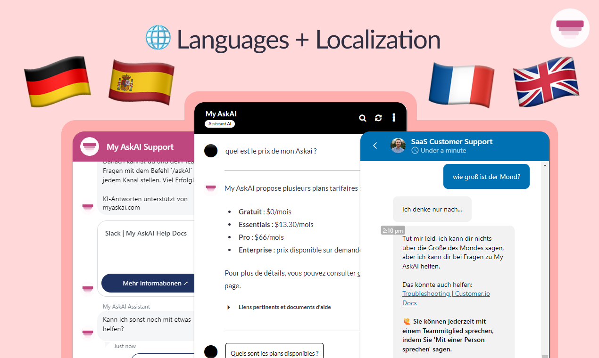

# 🌍 Languages and Localization


Available on our Pro plan.


<figure><figcaption></figcaption></figure>

### How do I change the language and localize my AI agent?

To change the language and localize your AI agent:

1. Log into your Dashboard.
2. Go to **AI Agent setup > Customization.**
3. Scroll to the bottom of the page, to where it says "Language".
4. Toggle the "Enable non-English support" switch.
5. Select your AI assistant's language from the drop-down.

<figure><figcaption></figcaption></figure>

6. Refresh your widget conversation and refresh the page.
7. Your AI support agent will now respond in, and all elements of your widget will be localized to your chosen language.

### Can I upload non-English content and websites?

Websites and content can be uploaded in any language, regardless of which language you want your AI agent to respond in.

### Can I ask questions or chat in other languages?

By default, if you ask a question your AI agent will answer in English.&#x20;

If you would like to chat in [other languages](languages-and-localization.md#which-languages-do-you-support), you must be on a Pro plan.

### Can I change the language and localize Zendesk, Intercom or HubSpot?

You can change the language and localize both the Intercom and Zendesk widgets, but not currently HubSpot (get in touch via chat if you need HubSpot in other languages).

### Which languages do you support?

We currently support:

* Arabic
* Bengali
* Bulgarian
* Chinese
* Czech
* Danish
* Dutch
* English (British)
* English (US) (_default_)
* Finnish
* French
* German
* Greek
* Hebrew
* Hindi
* Hungarian
* Indonesian
* Italian
* Japanese
* Korean
* Malay
* Norwegian
* Polish
* Portuguese
* Romanian
* Russian
* Spanish
* Swahili
* Swedish
*
  Turkish
* Vietnamese

We also support other languages by request, if you need an additional language, sign up for a Pro plan and get in touch with us via chat and we will add your language right away.

### Do you support multilingual responses?

We do support multilingual AI responses and can also auto-detect languages for localization.&#x20;

### Can I localize my AI support agent?

Yes, you can localize your agent, [follow these instructions that will show you how](languages-and-localization.md#how-do-i-change-the-language-and-localize-my-ai-agent-askai).&#x20;

In addition, you are also able to change the [Starter Questions](customization.md#starter-questions) and [Welcome Message](customization.md#welcome-message) text to any language of your choosing.
